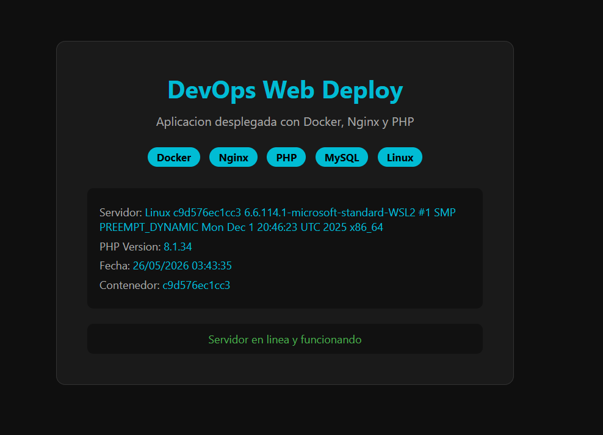

# DevOps-Web-Deploy
Despliegue de aplicacion web con Docker, Mysql y Nginx en servidor Linux 
## Tecnologías utilizadas

- Docker y Docker Compose
- Nginx como servidor web
- PHP 8.1
- MySQL 8.0
- Linux (Ubuntu/WSL2)

## Arquitectura del proyecto
Cliente → Nginx (puerto 8080) → PHP-FPM → MySQL
Tres contenedores corriendo en una red privada de Docker:
- nginx_server — recibe las peticiones HTTP
- php_app — procesa el código PHP
- mysql_db — base de datos relacional
## Vista previa



## Cómo ejecutar el proyecto
1. Clona el repositorio
```bash
git clone https://github.com/Felpe934/DevOps-Web-Deploy.git
cd DevOps-Web-Deploy
```
2. Levanta los contenedores
```bash
docker-compose up -d
```
3. Abre en el navegador: 
localhost:8080

4. Para detener los contenedores
```bash
docker-compose down
```

## Lo que demuestra este proyecto
- Configuración de múltiples contenedores con Docker Compose
- Comunicación entre servicios en red privada
- Configuración de Nginx como reverse proxy hacia PHP-FPM
- Despliegue de base de datos MySQL en contenedor
- Resolución de conflictos de puertos en entornos de producción

## Autor

Carlos Felipe Blancas Arreola
Ingeniero en Desarrollo de Software